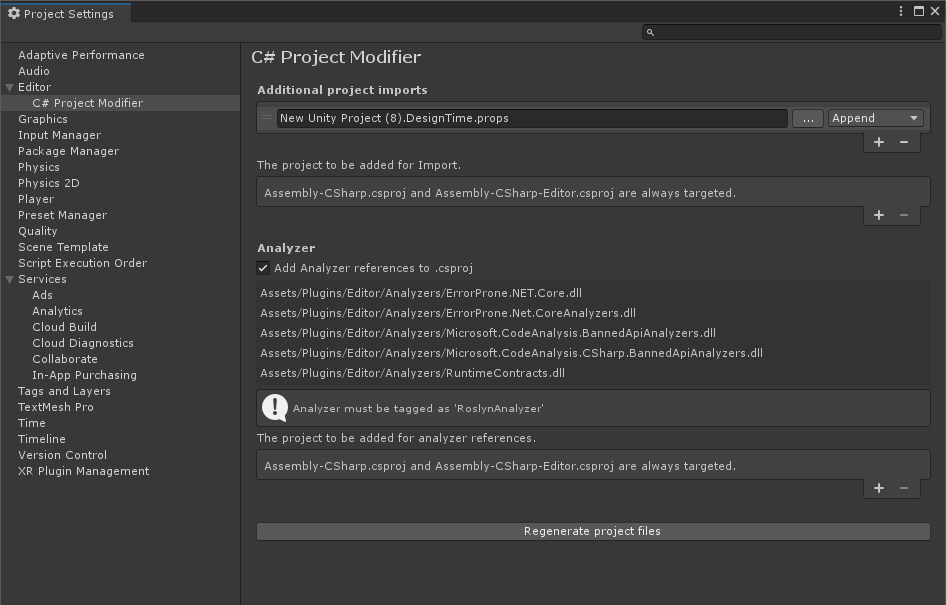

# CsprojModifier

CsprojModifier improves the developer experience in Visual Studio and Rider by performing additional processing when Unity Editor generates .csproj.

[日本語](README.ja.md)

CsprojModifier provides following features:

- Insert additional projects as `Import` elements into generated .csproj
- Add analyzer references to generated .csproj
  - Disabled if you are using Rider or Visual Studio Code with Unity 2020.2 or later



<!-- START doctoc generated TOC please keep comment here to allow auto update -->
<!-- DON'T EDIT THIS SECTION, INSTEAD RE-RUN doctoc TO UPDATE -->
## Table of Contents

- [Works with](#works-with)
- [Install](#install)
- [Features](#features)
  - [Insert additional projects as `Import` elements into generated .csproj](#insert-additional-projects-as-import-elements-into-generated-csproj)
    - [Example](#example)
    - [Inject the contents of additional project files (.props, .targets) directly instead of importing them](#inject-the-contents-of-additional-project-files-props-targets-directly-instead-of-importing-them)
  - [Add analyzer references to generated .csproj](#add-analyzer-references-to-generated-csproj)
    - [How to use](#how-to-use)
- [License](#license)

<!-- END doctoc generated TOC please keep comment here to allow auto update -->

## Works with
- Unity Editor 2019.4 (LTS) or later
- Visual Studio 2019 or Rider

## Install
Add the package via git from Package Manager.

If you are using Unity 2019.1 or later, you can use Package Manager to install a package via git.

```
https://github.com/Cysharp/CsprojModifier.git?path=src/CsprojModifier/Assets/CsprojModifier
```

## Features

### Insert additional projects as `Import` elements into generated .csproj
Add references to additional project files (.props or .targets) to the generated .csproj using `Import` element. This enables you to add files to the project, add references, and so on.

**Note:** .csproj is only used in IDEs such as Visual Studio and Rider, and does not affect the actual compile time by Unity Editor.

#### Example
For example, you can create the following file `YourAwesomeApp.DesignTime.props` and import it to use [BannedApiAnalyzer](https://github.com/dotnet/roslyn-analyzers/tree/main/src/Microsoft.CodeAnalysis.BannedApiAnalyzers).

```xml
<Project xmlns="http://schemas.microsoft.com/developer/msbuild/2003">
  <ItemGroup>
    <Analyzer Include="Assets/Plugins/Editor/Analyzers/Microsoft.CodeAnalysis.BannedApiAnalyzers.dll" />
    <Analyzer Include="Assets/Plugins/Editor/Analyzers/Microsoft.CodeAnalysis.CSharp.BannedApiAnalyzers.dll" />
  </ItemGroup>
  <ItemGroup>
    <AdditionalFiles Include="$(ProjectDir)\BannedSymbols.txt" />
  </ItemGroup>
</Project>
```

[BannedApiAnalyzer](https://github.com/dotnet/roslyn-analyzers/tree/main/src/Microsoft.CodeAnalysis.BannedApiAnalyzers) expects BannedSymbols.txt as `AdditionalFiles` to be included in the project, so adding it this way will work.

#### Inject the contents of additional project files (.props, .targets) directly instead of importing them
If you specify an insert position `Append Content` or `Prepend Content` as the insertion position, CsProjModifier will read the XML file and inject the elements directly into .csproj.

```xml
<!-- * Example: `Prepend: MyApp.Unity.props` -->
<Project ToolsVersion="4.0" DefaultTargets="Build" xmlns="http://schemas.microsoft.com/developer/msbuild/2003">
  <!--MyApp.Unity.props:HASH-->
  <Import Project="MyApp.Unity.props" />

  <!-- .csproj content generated by Unity Editor -->
  <!-- ... -->
</Project>

<!-- * Example: `Prepend Content: MyApp.Unity.props` -->
<Project ToolsVersion="4.0" DefaultTargets="Build" xmlns="http://schemas.microsoft.com/developer/msbuild/2003">
  <!--MyApp.Unity.props:HASH-->
  <ItemGroup>
    <!-- ... -->
    <!-- ... -->
    <!-- ... -->
  </ItemGroup>

  <!-- .csproj content generated by Unity Editor -->
  <!-- ... -->
</Project>
```

### Add analyzer references to generated .csproj
**NOTE**: Disabled this feature if you are using Rider or Visual Studio Code with Unity 2020.2 or later. Unity Editor has Roslyn Analyzer IDE support.

[Roslyn analyzers are supported in Unity 2020.2 or later](https://docs.unity3d.com/Manual/roslyn-analyzers.html). However,  currently, Roslyn analyzers are not included in .csproj, and those are only used at compile time.

The extension will insert `Analzyer` element into .csproj when generating the project file. As a result, you can run Roslyn Analyzer when editing code in Visual Studio. (of course, you can use it before 2020.2!)

#### How to use
[Add Roslyn Analyzer to your project in the same way that it is supported in 2020.2.](https://docs.unity3d.com/Manual/roslyn-analyzers.html)

- Add the Roslyn analyzer libraries
- Uncheck all target platforms in the Plugin inspector
- Add Asset Label `RoslynAnalyzer` to the libraries

## License
MIT License